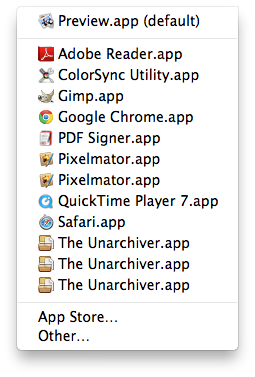
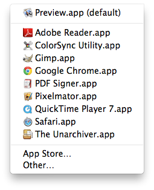
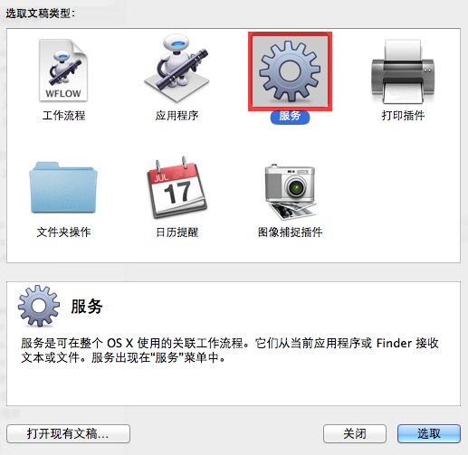
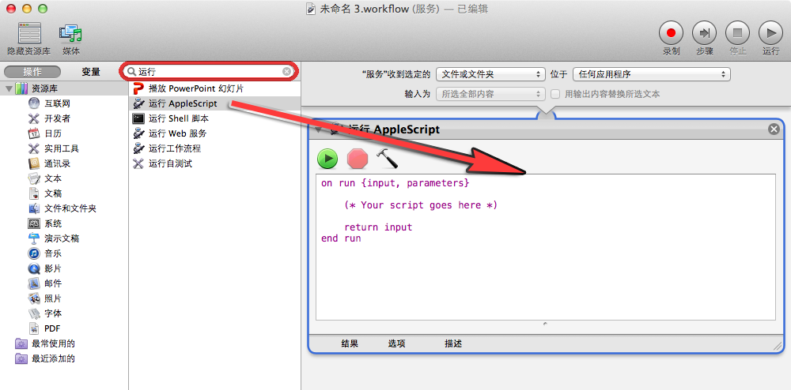
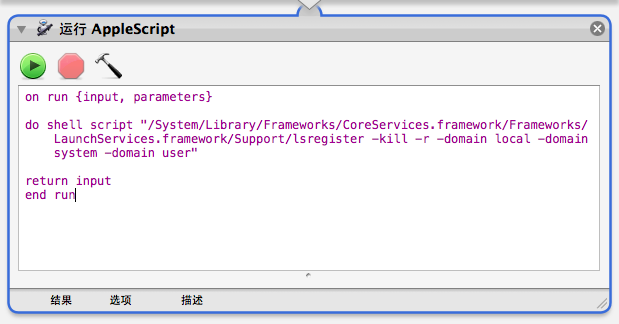
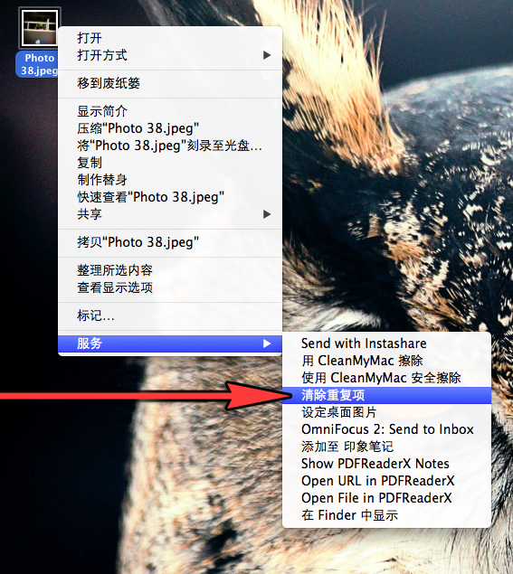
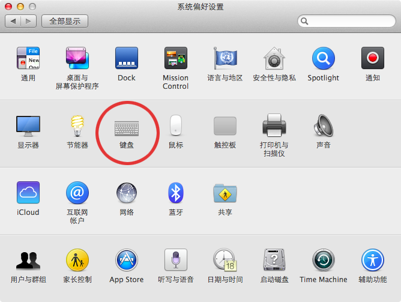
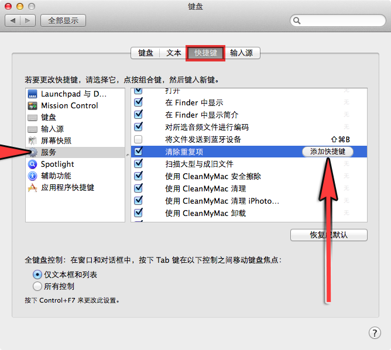
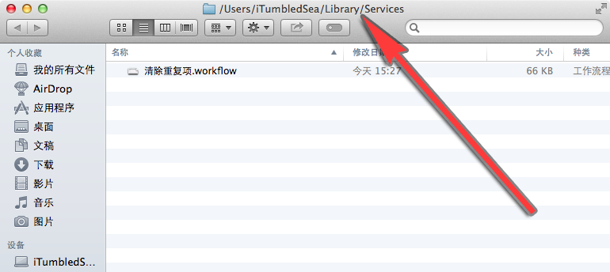

# 删除右键菜单重复项目   
*Mac 基础教程：如何删除右键菜单重复项目*   

我是忠实的 Mac 粉丝，我爱我的 Mac，和她相伴的时光总是美好的。但是有时候她会做出一些奇怪的事情，比如说当我在某个文件上点击右键想寻找合适的应用程序打开时，却发现她显示着一些重复的选项。虽然不影响使用，但对于我来说，这简直是要把我逼疯的节奏。   
   

后来事实证明，该问题的解决方案是相当容易的。我们只要借助「终端」应用程序就可以了。   

## 使用「终端」删除右键菜单重复项目
第一步：打开「终端」应用程序。    
第二步：输入如下命令。   
```bash
/System/Library/Frameworks/CoreServices.framework/Versions/A/Frameworks/LaunchServices.framework/Versions/A/Support/lsregister -kill -r -domain local -domain user
```   
第三步：按下「Return」键即可。   
现在当你再次右键点击一个文件，鼠标悬停在「打开方式」选项上时，你会发现这些重复的右键菜单项目已被全部清理了，清清爽爽。   

   

下一次右键菜单再出现这种重复现象的时候，一定要试一下该命令。   
有人可能觉得这篇教程就此结束了。哦不……   
考虑到有人会忘记这条终端命令，下面我们可以借助 Automator 应用程序将上述过程创建成一款应用程序或是一项右键菜单服务。由于我以前的一篇如何一键退出所有打开的应用程序教程中已经演示过如何创建 Automator 应用程序，这一次我们来创建一项右键菜单服务吧，这样当你每次发现右键菜单存在重复项时，你可以直接移动到右键菜单最底端的「服务」项下找到这一功能。    
废话不多说，我们开始动手。   

## 使用「Automator」创建服务菜单项
第一步：打开 Automator 应用程序。   
第二步：选择「服务」选项，点击右下方的「选取」按钮。   
    
第三步：选择「服务」的输入来源，这里我们选择「文件和文件夹」选项即可。   
    
第四步：在 Automator 搜索框里面键入「运行」关键字，选中「运行 AppleScript」选项，然后将它拖拽至右方的工作流中。   
   
第五步：编辑 AppleScript，输入如下内容即可。   
```vim
on run {input, parameters}

do shell script
"/System/Library/Frameworks/CoreServices.framework/Frameworks/LaunchServices.framework/Support/lsregister -kill -r -domain local -domain system -domain user"

return input
end run
```   
**注**：其实你只需要变动中间括号中的「＊Your script goes here＊」那部分即可。   
   
第六步：按下「Command ＋ S」快捷键，弹出服务命名面板，这里我们将它命名为「清除重复项」。   
好了，下一次当你发现右键菜单出现重复选项时，只需要转到最底部的「服务」选项，选择「清除重复项」即可。   
   
当然，你还可以给这一服务分配快捷键。   

## 给服务菜单创建键盘快捷键
第一步：打开系统偏好设置。   
第二步：选择「键盘」选项。   
   
第三步：选择「快捷键」选项卡。   
第四步：在左栏选中「服务」项，接着转到右栏找到刚刚创建的「清除重复项」。   
     
第五步：点击「添加快捷键」按钮来分配快捷键即可。   
注：那么刚刚创建的这一服务究竟存储在哪呢？哪天我想删除它该怎么办。别着急，你只需打开 Finder 应用程序，找到路径「~/Library/Services/」即可见到所有已经添加的项目。   
   
你觉得 Automator 如何？你喜欢使用它创建应用程序还是创建服务菜单呢？如果你有相关的想法和建议，欢迎在下方的评论栏留言。   
