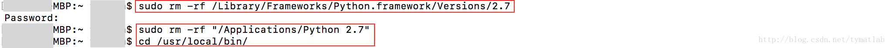
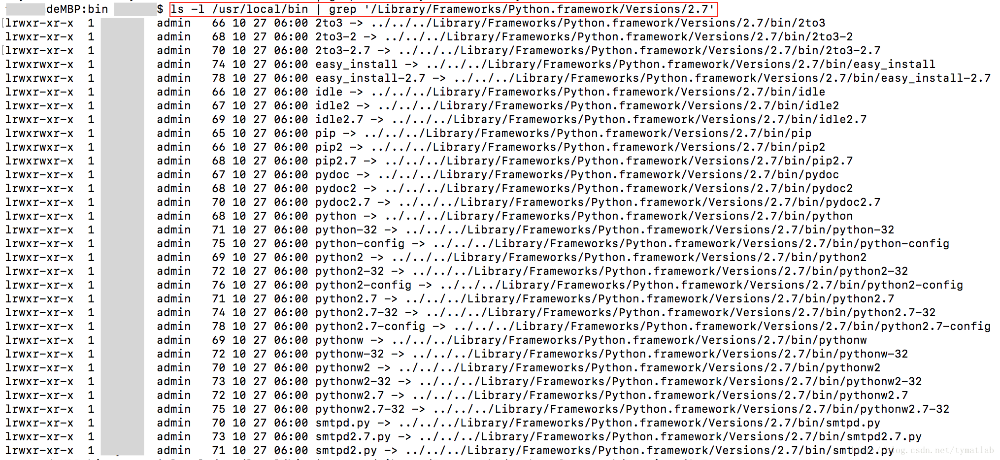
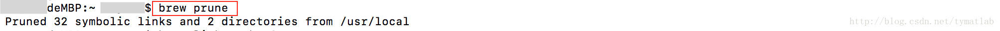

# Mac 删除/卸载 自己安装的python   
### 官网pkg安装的python版本   
第一步：删除框架    
```bash
sudo rm -rf /Library/Frameworks/Python.framework/Versions/2.7
```   
第二步：删除应用目录   
```bash
sudo rm -rf /Applications/Python 2.7
```   
第三步：删除指向python的链接   
```bash
cd /usr/local/bin/
ls -l /usr/local/bin | grep '/Library/Frameworks/Python.framework/Versions/2.7'   # 查看链接
brew cleanup  # 清除链接和目录
```   
清除后可再次查看链接，会发现链接已清除    
查看配置路径的环境文件，例如 `~/.bash_login`, `~/.bash_profile`, `~/.cshrc`, `~/.profile`, `~/.tcshrc`,  `~/.zprofile`    
我是用的`zsh`+`oh-my-zsh`所以要对`~/.zprofile`进行修改删掉`/Library/Frameworks/Python.framework/Versions/2.7`   
    
附图：   
   
   
    
## [Stackoverflow](https://stackoverflow.com/questions/3819449/how-to-uninstall-python-2-7-on-a-mac-os-x-10-6-4/3819829#3819829)   
**Do not attempt to remove any Apple-supplied system Python which are in `/System/Library` and `/usr/bin`, as this may break your whole operating system.**   

> **NOTE**: The steps listed below do not affect the Apple-supplied system Python 2.7; they only remove a third-party Python framework, like those installed by python.org installers.   

The complete list is documented here. Basically, all you need to do is the following:   
1. Remove the third-party Python 2.7 framework   
```bash
sudo rm -rf /Library/Frameworks/Python.framework/Versions/2.7
```
2. Remove the Python 2.7 applications directory   
```bash
sudo rm -rf "/Applications/Python 2.7"
```
3. Remove the symbolic links, in /usr/local/bin, that point to this Python version. See them using  
```bash
ls -l /usr/local/bin | grep '../Library/Frameworks/Python.framework/Versions/2.7' 
```
and then run the following command to remove all the links:   
```bash
cd /usr/local/bin/
ls -l /usr/local/bin | grep '../Library/Frameworks/Python.framework/Versions/2.7' | awk '{print $9}' | tr -d @ | xargs rm
```   
4. If necessary, edit your shell profile file(s) to remove adding `/Library/Frameworks/Python.framework/Versions/2.7` to your `PATH` environment file. Depending on which shell you use, any of the following files may have been modified: `~/.bash_login`, `~/.bash_profile`, `~/.cshrc`, `~/.profile`, `~/.tcshrc`, and/or `~/.zprofile`.
