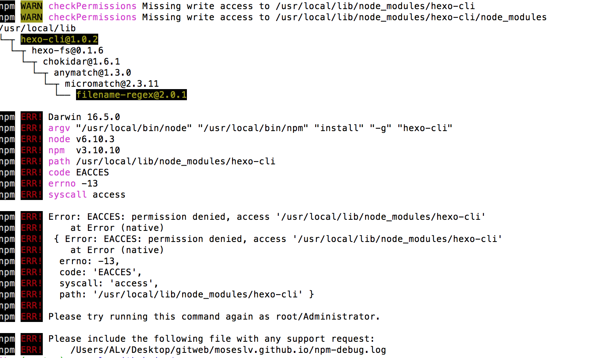

# 命令行安装程序的时候提示权限不够

- 在安装Hexo的时候提示没有写入权限
    npm WARN checkPermissions Missing write access to `/usr/local/lib/node_modules/hexo-cli`    
        
    解决方法:    
    ```shell
    sudo chown -R `whoami` /usr/local/lib/node_modules
    ```
    然后:    
    ```shell
    npm install hexo-cli -g
    ```
    > [Mac install hexo use sudo but sitll permission denied](https://github.com/hexojs/hexo/issues/2785)