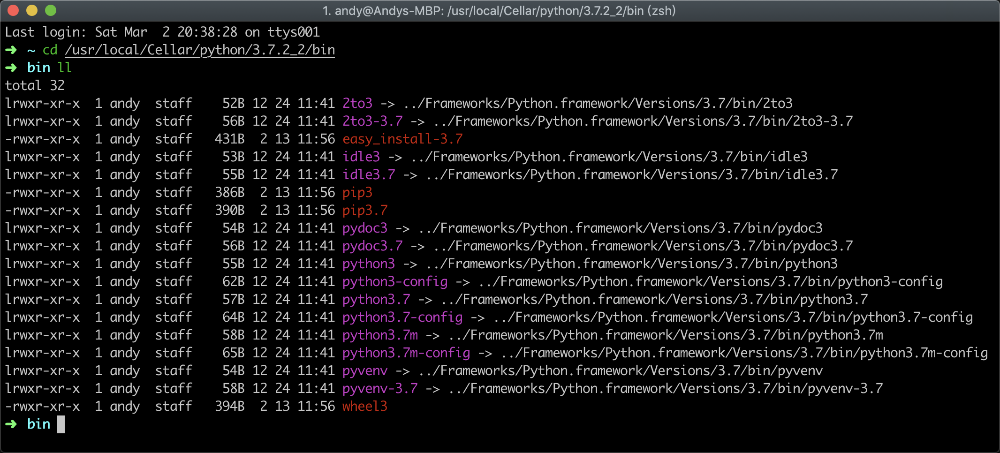
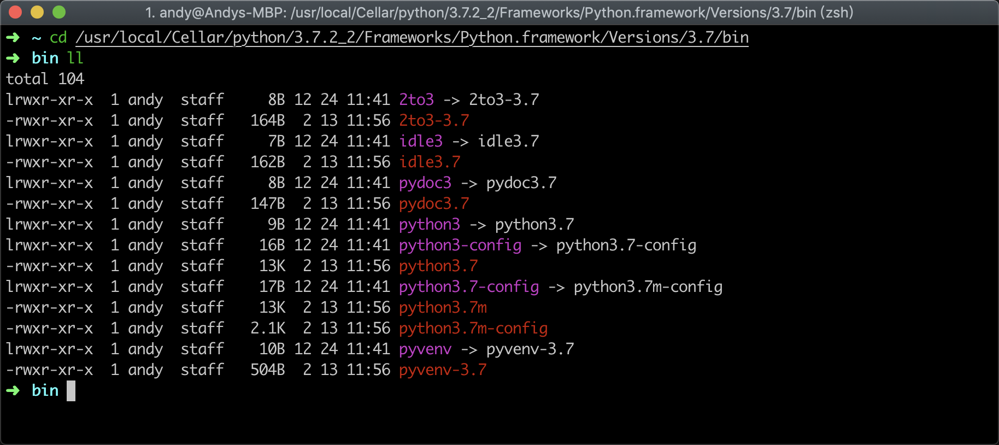

# Homebrew
> *Homebrew是macOS缺失的软件包的管理器*   

- [安装Homebrew](#安装Homebrew)
- [Homebrew装机必备包](#homebrew装机必备包)
- [Homebrew常用命令](#homebrew常用命令)

---
Homebrew官方网址： https://brew.sh/   

## 安装Homebrew
```bash
/usr/bin/ruby -e "$(curl -fsSL https://raw.githubusercontent.com/Homebrew/install/master/install)"
```   
将以上命令粘贴至终端。   

### Homebrew 能干什么?   

使用 Homebrew 安装 Apple 没有预装但 你需要的东西:   
```bash
$ brew install wget
```   
Homebrew 会将软件包安装到独立目录，并将其文件软链接至 /usr/local :   
```bash
$ cd /usr/local
$ find Cellar
Cellar/wget/1.16.1
Cellar/wget/1.16.1/bin/wget
Cellar/wget/1.16.1/share/man/man1/wget.1

$ ls -l bin
bin/wget -> ../Cellar/wget/1.16.1/bin/wget
```

Homebrew 不会将文件安装到它本身目录之外，所以您可将 Homebrew 安装到任意位置。   

轻松创建你自己的 Homebrew 包:   
```shell
$ brew create https://foo.com/bar-1.0.tgz
Created /usr/local/Homebrew/Library/Taps/homebrew/homebrew-core/Formula/bar.rb
```

完全基于 Git 和 ruby，所以自由修改的同时你仍可以轻松撤销你的变更或与上游更新合并:   
```shell
$ brew edit wget # 使用 $EDITOR 编辑!
```

Homebrew 的配方都是简单的 Ruby 脚本：
```vim
class Wget < Formula
  homepage "https://www.gnu.org/software/wget/"
  url "https://ftp.gnu.org/gnu/wget/wget-1.15.tar.gz"
  sha256 "52126be8cf1bddd7536886e74c053ad7d0ed2aa89b4b630f76785bac21695fcd"

  def install
    system "./configure", "--prefix=#{prefix}"
    system "make", "install"
  end
end
```
Homebrew 使 macOS 更完整。使用 gem 来安装 RubyGems、用 brew 来安装那些依赖包。   

"To install, drag this icon..." no more. brew cask installs macOS apps, fonts and plugins and other non-open source software.   
```bash
$ brew cask install firefox
```

Making a cask is as simple as creating a formula.   
```shell
$ brew cask create foo
Editing /usr/local/Homebrew/Library/Taps/homebrew/homebrew-cask/Casks/foo.rb
```

## Homebrew装机必备包
- brew-cask
- wget
- git
- cloc
- tree
- autojump
- ffmpeg
- cmake
- python3
  - 需要将`Python3`和`pip3`软连接到`/usr/local/bin/`下：    
    ```shell
    cd /usr/local/bin/
    ln -s ../Cellar/python/3.7.2_2/bin/python3 /usr/local/bin/python3
    ln -s ../Cellar/python/3.7.2_2/bin/pip3 /usr/local/bin/pip3
    ```
    `/usr/local/Cellar/python/3.7.2_2/bin/python3`是软连接到`/usr/local/Cellar/python/3.7.2_2/Frameworks/Python.framework/Versions/3.7/bin/python3`；
    `/usr/local/Cellar/python/3.7.2_2/bin/python3.7`是软连接到`/usr/local/Cellar/python/3.7.2_2/Frameworks/Python.framework/Versions/3.7/bin/python3.7`；
    `/usr/local/Cellar/python/3.7.2_2/Frameworks/Python.framework/Versions/3.7/bin/python3`软连接到`/usr/local/Cellar/python/3.7.2_2/Frameworks/Python.framework/Versions/3.7/bin/python3.7`，可以通过`ll`命令查看。他们之间的关系图如下:    
         
         
- macvim
- tmux
- htop
- gsed
  ```shell
  # gsed, brew install gsed
  PATH="/usr/local/opt/gnu-sed/libexec/gnubin:$PATH"
  ```

## Homebrew常用命令    
- `brew shellenv`    
  Prints export statements - run them in a shell and this installation of Homebrew will be included into your PATH, MANPATH and INFOPATH.    

  HOMEBREW_PREFIX, HOMEBREW_CELLAR and HOMEBREW_REPOSITORY are also exported to save multiple queries of those variables.    

  Consider adding evaluating the output in your dotfiles (e.g. ~/.profile) with eval $(brew shellenv)    

  运行以下命令:    
  ```
  brew shellenv
  ```
  结果如下:    
  ```bash
  export HOMEBREW_PREFIX="/usr/local"
  export HOMEBREW_CELLAR="/usr/local/Cellar"
  export HOMEBREW_REPOSITORY="/usr/local/Homebrew"
  export PATH="/usr/local/bin:/usr/local/sbin:$PATH"
  export MANPATH="/usr/local/share/man:$MANPATH"
  export INFOPATH="/usr/local/share/info:$INFOPATH"
  ```
- `brew install xxx`    
  安装xxx包    
- `brew uninstall xxx`    
  卸载xxx包    
- `brew search xxx`    
  搜索xxx包     
