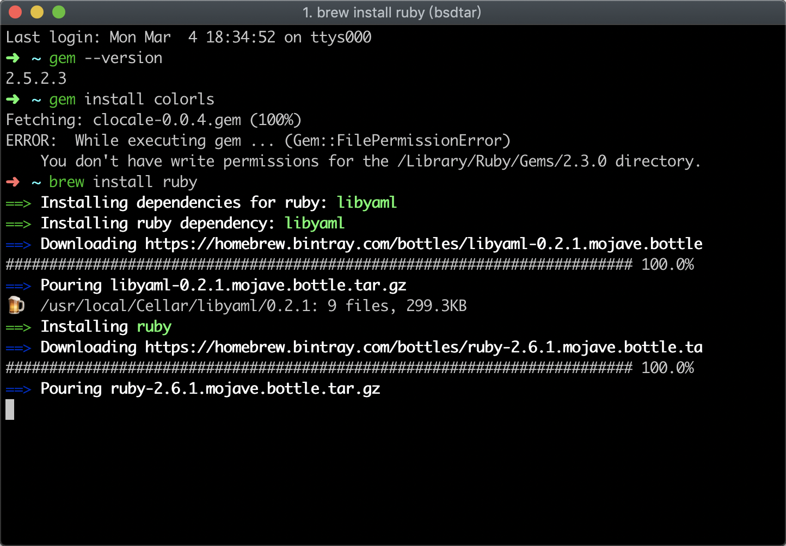
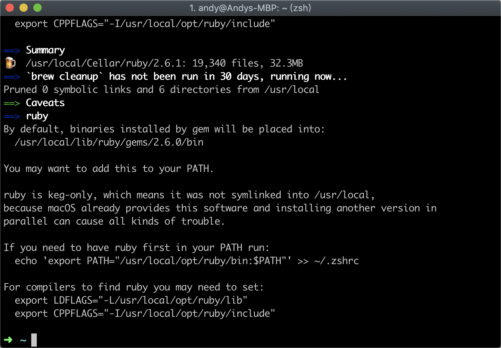
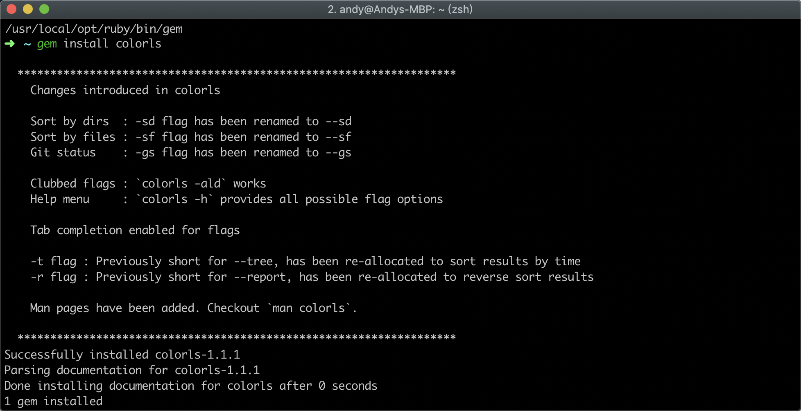
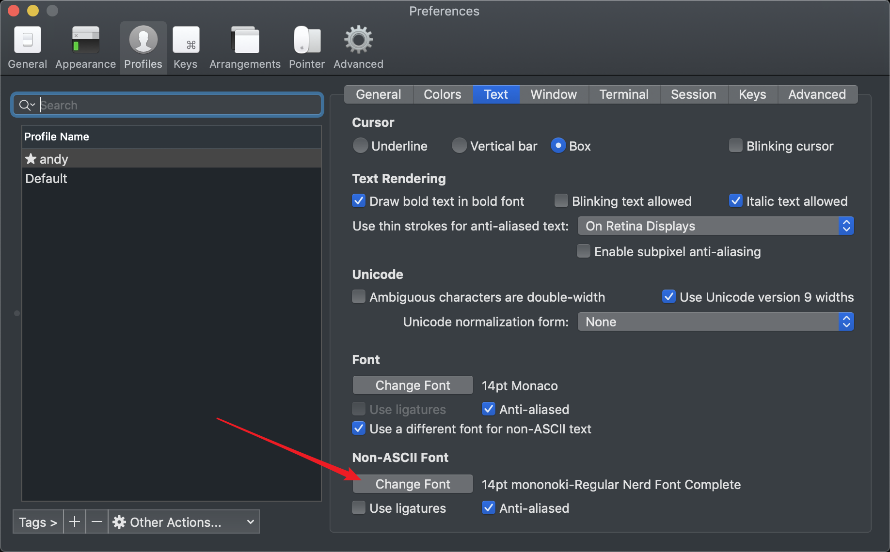
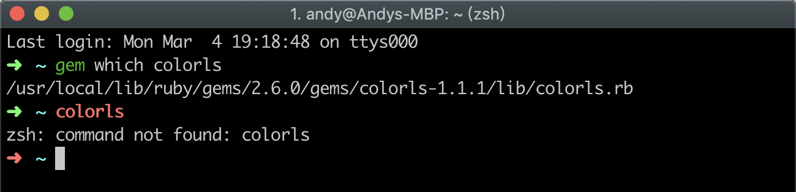
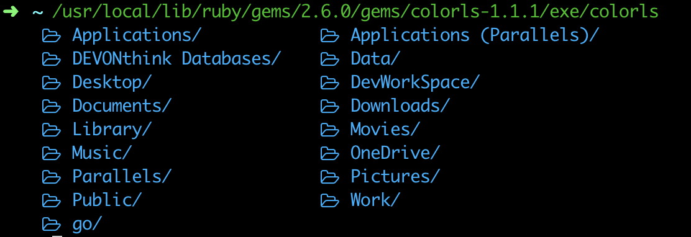
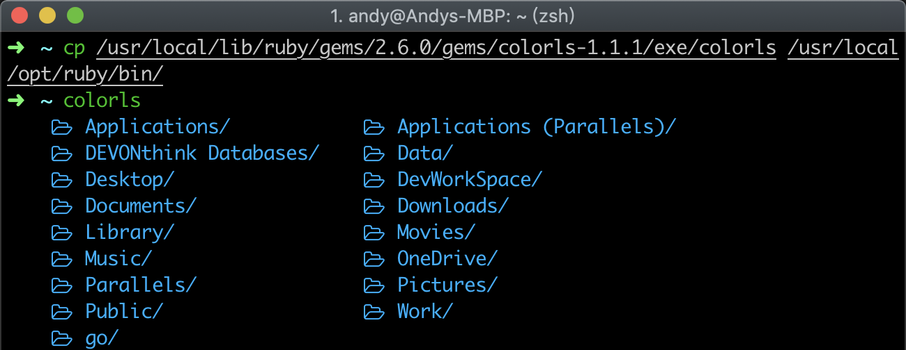
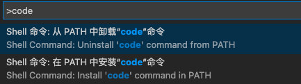

# Mac下的shell配置
- [**zsh**设置为默认shell](#zsh设置为默认shell)
- [安装**oh-my-zsh**](#安装oh-my-zsh)
- [安装**colorls**](#安装colorls)
- [安装**zsh-syntax-highlighting**](#安装zsh-syntax-highlighting)
- [VIM**手动**配置](#vim手动配置)
- [VIMRC**自动**配置VIM](#vimrc自动配置vim)
- [安装**Vundle**管理插件](#安装vundle管理插件)
- [VIM安装**YouCompleteMe**](#vim安装youcompleteme)
- [vimrc**最终配置**](#vimrc最终配置)
- [命令下启动vscode](#命令下启动vscode)


---
## zsh设置为默认shell
查看当前已安装shells：
```sh
cat /etc/shells
```

更改mac默认shell为zsh:
```bash
chsh -s /usr/local/bin/zsh
```
更改zsh配置文件：
```sh
vim ~/.zshrc
```
更改完配置记得运行：
```sh
source ~/.zshrc
```
还原默认shell：
```sh
chsh -s /bin/bash
```
### Zsh不支持通配符(* )匹配和正则表达式解决方法
在`~/.zshrc`中添加以下内容:

```shell
# ignore no matches
set -o nonomatch
#setopt nonomatch
```

---
## 安装oh-my-zsh
- via curl
    ```bash
    sh -c "$(curl -fsSL https://raw.github.com/ohmyzsh/ohmyzsh/master/tools/install.sh)"
    ```
- via wget
    ```bash
    sh -c "$(wget https://raw.github.com/ohmyzsh/ohmyzsh/master/tools/install.sh -O -)"
    ```
运行上述命令以后`~/.zshrc`会自动配置为:
```sh
# If you come from bash you might have to change your $PATH.
# export PATH=$HOME/bin:/usr/local/bin:$PATH

# Path to your oh-my-zsh installation.
export ZSH=$HOME/.oh-my-zsh

# Set name of the theme to load --- if set to "random", it will
# load a random theme each time oh-my-zsh is loaded, in which case,
# to know which specific one was loaded, run: echo $RANDOM_THEME
# See https://github.com/robbyrussell/oh-my-zsh/wiki/Themes
ZSH_THEME="robbyrussell"

# Set list of themes to pick from when loading at random
# Setting this variable when ZSH_THEME=random will cause zsh to load
# a theme from this variable instead of looking in ~/.oh-my-zsh/themes/
# If set to an empty array, this variable will have no effect.
# ZSH_THEME_RANDOM_CANDIDATES=( "robbyrussell" "agnoster" )

# Uncomment the following line to use case-sensitive completion.
# CASE_SENSITIVE="true"

# Uncomment the following line to use hyphen-insensitive completion.
# Case-sensitive completion must be off. _ and - will be interchangeable.
# HYPHEN_INSENSITIVE="true"

# Uncomment the following line to disable bi-weekly auto-update checks.
# DISABLE_AUTO_UPDATE="true"

# Uncomment the following line to change how often to auto-update (in days).
# export UPDATE_ZSH_DAYS=13

# Uncomment the following line to disable colors in ls.
# DISABLE_LS_COLORS="true"

# Uncomment the following line to disable auto-setting terminal title.
# DISABLE_AUTO_TITLE="true"

# Uncomment the following line to enable command auto-correction.
# ENABLE_CORRECTION="true"

# Uncomment the following line to display red dots whilst waiting for completion.
# COMPLETION_WAITING_DOTS="true"

# Uncomment the following line if you want to disable marking untracked files
# under VCS as dirty. This makes repository status check for large repositories
# much, much faster.
# DISABLE_UNTRACKED_FILES_DIRTY="true"

# Uncomment the following line if you want to change the command execution time
# stamp shown in the history command output.
# You can set one of the optional three formats:
# "mm/dd/yyyy"|"dd.mm.yyyy"|"yyyy-mm-dd"
# or set a custom format using the strftime function format specifications,
# see 'man strftime' for details.
# HIST_STAMPS="mm/dd/yyyy"

# Would you like to use another custom folder than $ZSH/custom?
# ZSH_CUSTOM=/path/to/new-custom-folder

# Which plugins would you like to load?
# Standard plugins can be found in ~/.oh-my-zsh/plugins/*
# Custom plugins may be added to ~/.oh-my-zsh/custom/plugins/
# Example format: plugins=(rails git textmate ruby lighthouse)
# Add wisely, as too many plugins slow down shell startup.
plugins=(git)

source $ZSH/oh-my-zsh.sh

# User configuration

# export MANPATH="/usr/local/man:$MANPATH"

# You may need to manually set your language environment
# export LANG=en_US.UTF-8

# Preferred editor for local and remote sessions
# if [[ -n $SSH_CONNECTION ]]; then
#   export EDITOR='vim'
# else
#   export EDITOR='mvim'
# fi

# Compilation flags
# export ARCHFLAGS="-arch x86_64"

# ssh
# export SSH_KEY_PATH="~/.ssh/rsa_id"

# Set personal aliases, overriding those provided by oh-my-zsh libs,
# plugins, and themes. Aliases can be placed here, though oh-my-zsh
# users are encouraged to define aliases within the ZSH_CUSTOM folder.
# For a full list of active aliases, run `alias`.
#
# Example aliases
# alias zshconfig="mate ~/.zshrc"
# alias ohmyzsh="mate ~/.oh-my-zsh"
```

升级oh-my-zsh
```bash
omz update
```

设置golang环境:
```sh
# GO PATH
export GOPATH=$HOME/go
export GOROOT=/usr/local/go
export PATH=$PATH:$GOROOT/bin:$GOPATH/bin

LC_CTYPE=en_US.UTF-8
LC_ALL=en_US.UTF-8

# some more ls aliases
alias ll='ls -alF'
alias la='ls -A'
alias l='ls -CF'
```
---
## 安装colorls
*项目GitHub地址: https://github.com/athityakumar/colorls*

**先上效果图**:


#### 安装
1. `Mac`检查`Ruby`版本 (preferably, version > 2.1)
    默认情况下，`Mac OS X`系统已经安装好 `Ruby`，在命令行下可以直接通过以下命令，确认系统`Ruby`的版本信息:
    ```sh
    ruby --version
    ```
    若系统自带的`Ruby`版本不符合`>2.1`上述要求，推荐使用`homebrew`来安装、管理`Ruby`的版本:
    ```sh
    brew update
    brew install ruby
    echo '# Ruby installed by Homebrew' >> ~/.zshrc
    echo 'export PATH="/usr/local/opt/ruby/bin:$PATH"' >> ~/.zshrc
    ```
    
    
    
    

2. **安装字体**并设置`iTerm2`的显示字体，否则`icon`显示不全， 推荐`powerline nerd-font`。 可以查看 [Nerd Font README](https://github.com/ryanoasis/nerd-fonts/blob/master/readme.md) 来获得更多安装详细介绍。

    *Note for `iTerm2` users - Please enable the **Nerd Font** at `iTerm2 > Preferences > Profiles > Text > Non-ASCII font > mononoki Nerd Font`.*
    

3. Install the [colorls](https://rubygems.org/gems/colorls/) ruby gem with：
    ```shell
    gem install colorls
    ```
    

4. Enable tab completion for flags by entering following line to your shell configuration file (`~/.bashrc` or `~/.zshrc`) :
    ```bash
    source $(dirname $(gem which colorls))/tab_complete.sh
    ```

#### 配置colorls环境
配置`Bash`或`Zsh`环境，这里以`Zsh`配置为例:
进入`~/.zshrc`配置文件:
```shell
vim ~/.zshrc
```
在文件末追加以下内容:
```sh
# Colorls
PATH=$PATH:$(ruby -e 'puts Gem.bindir')
```
在命令行可以使用`colorls`来代替`ls`，也可以通过下面配置**ls别名**来替代`colorls`:
```shell
alias ls='colorls'
alias ll='colorls -lA --report'
alias lc='colorls -lA --sd'
```
使其生效:
```shell
source ~/.zshrc
```

#### 安装过程中遇到的问题
在安装的过程中遇到`Zsh`不识别`colorls`命令:

但是运行`/usr/local/lib/ruby/gems/2.6.0/gems/colorls-1.1.1/exe/colorls`是可以的：

临时的解决方法是(上面的`colorls配置`已经彻底解决该问题，以下为当时的心路历程,😂):
```shell
#cp /usr/local/lib/ruby/gems/2.6.0/gems/colorls-1.1.1/exe/colorls /usr/local/opt/ruby/bin/
cp /usr/local/lib/ruby/gems/2.6.0/bin/colorls /usr/local/opt/ruby/bin/
```

**经过跟作者的沟通原来是没有将`Gem.bindir`加入环境变量中， 上面`colorls配置`中已经添加，彻底解决了该问题**：
```shell
echo 'export ATH=$PATH:$(ruby -e 'puts Gem.bindir')"' >> ~/.zshrc
```
**[以下为作者的回答](https://github.com/athityakumar/colorls/issues/264)**
> @aimuch as I already said, you need to ensure your shell is able to find the colorls script. You should add the `Gem.bindir` directory to your `PATH` environment variable in order to run scripts from any installed gem.
> Look at the output of `gem environment`. The directory mentioned in `EXECUTABLE DIRECTORY` should be also listed in `SHELL PATH`.
> Add this to your shell init file:
>   `PATH=$PATH:$(ruby -e 'puts Gem.bindir')`

#### 升级colorls
```shell
gem update colorls
```
#### 卸载colorls
```shell
gem uninstall colorls
```

#### 参考资料
> [Terminal Experience](https://medium.com/@caulfieldOwen/youre-missing-out-on-a-better-mac-terminal-experience-d73647abf6d7)


---
## 安装zsh-syntax-highlighting
*已知命令语法高亮*
GitHub地址:https://github.com/zsh-users/zsh-syntax-highlighting

安装后效果如下:
Before: 
After:  

Before: 
After:  

Before: 
After:  


### **安装方法**:
- ### 安装到`Oh-my-zsh`
  1. Clone this repository in oh-my-zsh's plugins directory:
  ```bash
  git clone https://github.com/zsh-users/zsh-syntax-highlighting.git ${ZSH_CUSTOM:-~/.oh-my-zsh/custom}/plugins/zsh-syntax-highlighting
  ```
  2. Activate the plugin in `~/.zshrc`:
  ```sh
  plugins=(
            git
            autojump
            zsh-autosuggestions
            zsh-syntax-highlighting
          )
  ```
  3. Source ~/.zshrc to take changes into account:
  ```bash
  source ~/.zshrc
  ```

- ### 安装到`~/.zshrc`
  1. Simply clone this repository and source the script:
  ```bash
  git clone https://github.com/zsh-users/zsh-syntax-highlighting.git
  echo "source ${(q-)PWD}/zsh-syntax-highlighting/zsh-syntax-highlighting.zsh" >> ${ZDOTDIR:-$HOME}/.zshrc
  ```
  2. Then, enable syntax highlighting in the current interactive shell:
  ```bash
  source ./zsh-syntax-highlighting/zsh-syntax-highlighting.zsh
  ```
  If git is not installed, download and extract a snapshot of the latest development tree from:
  ```vim
  https://github.com/zsh-users/zsh-syntax-highlighting/archive/master.tar.gz
  ```
  Note the `source` command must be **at the end of** `~/.zshrc`:
  ```bash
  source ~/.zshrc
  ```

---
## VIM手动配置

基础平台：`MacBook Pro` ，原生`shell`支持.
Mac自带的是`vi`，需要安装`vim`, `homebrew`安装: `brew install vim`
配置文件在用户目录下`~/.vimrc`,如果没有，就自己创建一个: `vim ~/.vimrc` 然后添加以下内容:
```vim
" 显示行号
set number
" 显示标尺
set ruler
" 历史纪录
set history=1000
" 输入的命令显示出来，看的清楚些
set showcmd
" 状态行显示的内容
set statusline=%F%m%r%h%w\ [FORMAT=%{&ff}]\ [TYPE=%Y]\ [POS=%l,%v][%p%%]\ %{strftime(\"%d/%m/%y\ -\ %H:%M\")}
" 启动显示状态行1，总是显示状态行2
set laststatus=2
" 语法高亮显示
syntax on
set fileencodings=utf-8,gb2312,gbk,cp936,latin-1
set fileencoding=utf-8
set termencoding=utf-8
set fileformat=unix
set encoding=utf-8
" 配色方案
colorscheme desert
" 指定配色方案是256色
set t_Co=256
set wildmenu
" 去掉有关vi一致性模式，避免以前版本的一些bug和局限，解决backspace不能使用的问题
set nocompatible
set backspace=indent,eol,start
set backspace=2
" 启用自动对齐功能，把上一行的对齐格式应用到下一行
set autoindent
" 依据上面的格式，智能的选择对齐方式，对于类似C语言编写很有用处
set smartindent
" vim禁用自动备份
set nobackup
set nowritebackup
set noswapfile
" 用空格代替tab
set expandtab
" 设置显示制表符的空格字符个数,改进tab缩进值，默认为8，现改为4
set tabstop=4
" 统一缩进为4，方便在开启了et后使用退格(backspace)键，每次退格将删除X个空格
set softtabstop=4
" 设定自动缩进为4个字符，程序中自动缩进所使用的空白长度
set shiftwidth=4
" 设置帮助文件为中文(需要安装vimcdoc文档)
set helplang=cn
" 显示匹配的括号
set showmatch
" 文件缩进及tab个数
au FileType html,python,vim,javascript setl shiftwidth=4
au FileType html,python,vim,javascript setl tabstop=4
au FileType java,php setl shiftwidth=4
au FileType java,php setl tabstop=4
" 高亮搜索的字符串
set hlsearch
" 检测文件的类型
filetype on
filetype plugin on
filetype indent on
" C风格缩进
set cindent
set completeopt=longest,menu
" 功能设置
" 去掉输入错误提示声音
set noeb
" 自动保存
set autowrite
" 突出显示当前行
set cursorline
" 突出显示当前列
set cursorcolumn
"设置光标样式为竖线vertical bar
" Change cursor shape between insert and normal mode in iTerm2.app
"if $TERM_PROGRAM =~ "iTerm"
let &t_SI = "\<Esc>]50;CursorShape=1\x7" " Vertical bar in insert mode
let &t_EI = "\<Esc>]50;CursorShape=0\x7" " Block in normal mode
"endif
" 共享剪贴板
set clipboard+=unnamed
" 文件被改动时自动载入
set autoread
" 顶部底部保持3行距离
set scrolloff=3
```

---
## VIMRC自动配置VIM
```bash
git clone --depth=1 https://github.com/amix/vimrc.git ~/.vim_runtime

sh ~/.vim_runtime/install_awesome_vimrc.sh
```
安装后`~/.vimrc`会自动配置为：
```vim
 set runtimepath+=~/.vim_runtime

 source ~/.vim_runtime/vimrcs/basic.vim
 source ~/.vim_runtime/vimrcs/filetypes.vim
 source ~/.vim_runtime/vimrcs/plugins_config.vim
 source ~/.vim_runtime/vimrcs/extended.vim

 try
 source ~/.vim_runtime/my_configs.vim
 catch
 endtry
```

**升级`vimrc`**:
```bash
cd ~/.vim_runtime
git pull --rebase
```

---
## 安装Vundle管理插件
官方GitHub地址: https://github.com/VundleVim/Vundle.vim

### 快速开始
- 介绍:
安装需要`Git`,触发g`it clone`,默认将每一个指定特定格式插件的仓库复制到`~/.vim/bundle/`. 搜索需要`Curl`支持.

- 初始安装 Vundle:
```bash
git clone https://github.com/VundleVim/Vundle.vim.git ~/.vim/bundle/Vundle.vim
```
- 配置插件 :
请将以下加在 `.vimrc` 方可使用`Vundle`. 删掉你不需要的插件, 这些只是用做示例:
```vim
set nocompatible              " 去除VI一致性,必须
filetype off                  " 必须

" 设置包括vundle和初始化相关的runtime path
set rtp+=~/.vim/bundle/Vundle.vim
call vundle#begin()
" 另一种选择, 指定一个vundle安装插件的路径
"call vundle#begin('~/some/path/here')

" 让vundle管理插件版本,必须
Plugin 'VundleVim/Vundle.vim'

" 以下范例用来支持不同格式的插件安装.
" 请将安装插件的命令放在vundle#begin和vundle#end之间.
" Github上的插件
" 格式为 Plugin '用户名/插件仓库名'
Plugin 'tpope/vim-fugitive'
" 来自 http://vim-scripts.org/vim/scripts.html 的插件
" Plugin '插件名称' 实际上是 Plugin 'vim-scripts/插件仓库名' 只是此处的用户名可以省略
Plugin 'L9'
" 由Git支持但不再github上的插件仓库 Plugin 'git clone 后面的地址'
Plugin 'git://git.wincent.com/command-t.git'
" 本地的Git仓库(例如自己的插件) Plugin 'file:///+本地插件仓库绝对路径'
"Plugin 'file:///home/andy/path/to/plugin'
" 插件在仓库的子目录中.
" 正确指定路径用以设置runtimepath. 以下范例插件在sparkup/vim目录下
Plugin 'rstacruz/sparkup', {'rtp': 'vim/'}
" 安装L9，如果已经安装过这个插件，可利用以下格式避免命名冲突
"Plugin 'ascenator/L9', {'name': 'newL9'}
" YouCompleteMe
Plugin 'Valloric/YouCompleteMe'
Plugin 'yggdroot/indentline'
Plugin 'jiangmiao/auto-pairs'

" 你的所有插件需要在下面这行之前
call vundle#end()            " 必须
filetype plugin indent on    " 必须 加载vim自带和插件相应的语法和文件类型相关脚本
" 忽视插件改变缩进,可以使用以下替代:
"filetype plugin on
"
" 简要帮助文档
" :PluginList       - 列出所有已配置的插件
" :PluginInstall    - 安装插件,追加 `!` 用以更新或使用 :PluginUpdate
" :PluginSearch foo - 搜索 foo ; 追加 `!` 清除本地缓存
" :PluginClean      - 清除未使用插件,需要确认; 追加 `!` 自动批准移除未使用插件
"
" 查阅 :h vundle 获取更多细节和wiki以及FAQ
" 将你自己对非插件片段放在这行之后
```

- 安装插件:
运行 `vim` 再运行 : `PluginInstall`
更新 `vim` 插件: `PluginUpdate`
清理未使用都插件:  `PluginClean`

---
## VIM安装YouCompleteMe
上一步已经在`Vundle`中通过`Plugin 'valloric/youcompleteme'`下载好插件，但是需要手动编译安装:

### (1) 进入YouCompleteMe文件夹下
```bash
cd  ~/.vim/bundle/YouCompleteMe/
```

### (2) 编译
```bash
./install.py  --clang-completer --go-completer --ts-completer
```
参数--clang-completer是为了支持C/C++的补全，--go-completer是为了支持Go的补全, --ts-completer是为了支持JavaScript的补全。编译过程比较长，耐心等待。
安装的时候有报错信息：
```bash
/Library/Developer/CommandLineTools/usr/bin/ranlib: file: libBoostParts.a(windows_file_codecvt.cpp.o) has no symbols
/Library/Developer/CommandLineTools/usr/bin/ranlib: file: libBoostParts.a(icu.cpp.o) has no symbols
/Library/Developer/CommandLineTools/usr/bin/ranlib: file: libBoostParts.a(instances.cpp.o) has no symbols
/Library/Developer/CommandLineTools/usr/bin/ranlib: file: libBoostParts.a(regex_debug.cpp.o) has no symbols
/Library/Developer/CommandLineTools/usr/bin/ranlib: file: libBoostParts.a(usinstances.cpp.o) has no symbols
/Library/Developer/CommandLineTools/usr/bin/ranlib: file: libBoostParts.a(w32_regex_traits.cpp.o) has no symbols
/Library/Developer/CommandLineTools/usr/bin/ranlib: file: libBoostParts.a(winstances.cpp.o) has no symbols
/Library/Developer/CommandLineTools/usr/bin/ranlib: file: libBoostParts.a(windows_file_codecvt.cpp.o) has no symbols
/Library/Developer/CommandLineTools/usr/bin/ranlib: file: libBoostParts.a(icu.cpp.o) has no symbols
/Library/Developer/CommandLineTools/usr/bin/ranlib: file: libBoostParts.a(instances.cpp.o) has no symbols
/Library/Developer/CommandLineTools/usr/bin/ranlib: file: libBoostParts.a(regex_debug.cpp.o) has no symbols
/Library/Developer/CommandLineTools/usr/bin/ranlib: file: libBoostParts.a(usinstances.cpp.o) has no symbols
/Library/Developer/CommandLineTools/usr/bin/ranlib: file: libBoostParts.a(w32_regex_traits.cpp.o) has no symbols
/Library/Developer/CommandLineTools/usr/bin/ranlib: file: libBoostParts.a(winstances.cpp.o) has no symbols
```
目前还没找到解决方法，不过不影响使用。

### (3) 找到文件.ycm_extra_conf.py在~/.vim/bundle/YouCompleteMe/third_party/ycmd/下面:
```bash
cd ~/.vim/bundle/YouCompleteMe/thrid_party/ycmd/
```
`ls -a` 即可看到。

自行在`YoucompleteMe/`中创建`cpp/ycm`目录，将 `.ycm_extra_conf.py`拷贝进去:
```bash
cd ~/.vim/bundle/YouCompleteMe
mkdir cpp
mkdir cpp/ycm
cp ~/.vim/bundle/YouCompleteMe/thrid_party/ycmd/.ycm_extra_conf.py ~/.vim/bundle/YouCompleteMe/cpp/ycm/
```
### (4) 修改.vimrc配置文件 将下面的内容添加到`~/.vimrc`里面:
```vim
" 寻找全局配置文件
let g:ycm_global_ycm_extra_conf = '~/.vim/bundle/YouCompleteMe/cpp/ycm/.ycm_extra_conf.py'
"let g:ycm_global_ycm_extra_conf = '~/.vim/bundle/YouCompleteMe/third_party/ycmd/.ycm_extra_conf.py'
" 禁用syntastic来对python检查
let g:syntastic_ignore_files=[".*\.py$"]
" 使用ctags生成的tags文件
let g:ycm_collect_identifiers_from_tag_files = 1
" 开启语义补全
" 修改对C语言的补全快捷键，默认是CTRL+space，修改为ALT+;未测出效果
"let g:ycm_key_invoke_completion = '<M-;>'
" 设置转到定义处的快捷键为ALT+G，未测出效果
"nmap <M-g> :YcmCompleter GoToDefinitionElseDeclaration <C-R>=expand("<cword>")<CR><CR>
"关键字补全
"let g:ycm_seed_identifiers_with_syntax = 1
" 在接受补全后不分裂出一个窗口显示接受的项
set completeopt-=preview
" 让补全行为与一般的IDE一致
set completeopt=longest,menu
" 不显示开启vim时检查ycm_extra_conf文件的信息
let g:ycm_confirm_extra_conf=0
" 每次重新生成匹配项，禁止缓存匹配项
let g:ycm_cache_omnifunc=0
" 在注释中也可以补全
let g:ycm_complete_in_comments=1
" 输入第一个字符就开始补全
let g:ycm_min_num_of_chars_for_completion=1
" 错误标识符
let g:ycm_error_symbol='>>'
" 警告标识符
let g:ycm_warning_symbol='>*'
" 不查询ultisnips提供的代码模板补全，如果需要，设置成1即可
" let g:ycm_use_ultisnips_completer=0
```
上面的内容中，除了第一句寻找全局配置文件，其他的语句可以根据自己的需要更改、删除或添加。
 **注**：如果没有在第(3)步中自己创建`cpp/ycm`目录拷贝`.ycm_extra_conf.py`文件，则需要将第一句中的路径改为全局配置文件所在的具体路径，如下：
```
let g:ycm_global_ycm_extra_conf = '~/.vim/bundle/YouCompleteMe/thrid_party/ycmd/.ycm_extra_conf.py'
```
### (5) 保存退出`.vimrc` ,打开一个`C/C++`源程序，体验其自动补全效果。
```vim
:wq
```

---
## vimrc最终配置

```vim
" >>>>>>>>> VIMRC
set runtimepath+=~/.vim_runtime

source ~/.vim_runtime/vimrcs/basic.vim
source ~/.vim_runtime/vimrcs/filetypes.vim
source ~/.vim_runtime/vimrcs/plugins_config.vim
source ~/.vim_runtime/vimrcs/extended.vim

try
source ~/.vim_runtime/my_configs.vim
catch
endtry

" <<<<<<<<< VIMRC


" >>>>>>>>> Vundle
"set nocompatible              " 去除VI一致性,必须
"filetype off                  " 必须

" 设置包括vundle和初始化相关的runtime path
set rtp+=~/.vim/bundle/Vundle.vim
call vundle#begin()
" 另一种选择, 指定一个vundle安装插件的路径
"call vundle#begin('~/some/path/here')

" 让vundle管理插件版本,必须
Plugin 'VundleVim/Vundle.vim'

" 以下范例用来支持不同格式的插件安装.
" 请将安装插件的命令放在vundle#begin和vundle#end之间.
" Github上的插件
" 格式为 Plugin '用户名/插件仓库名'
Plugin 'tpope/vim-fugitive'
Plugin 'Lokaltog/vim-easymotion'
Plugin 'FuzzyFinder'
" 来自 http://vim-scripts.org/vim/scripts.html 的插件
" Plugin '插件名称' 实际上是 Plugin 'vim-scripts/插件仓库名' 只是此处的用户名可以省略
Plugin 'L9'
" 由Git支持但不再github上的插件仓库 Plugin 'git clone 后面的地址'
Plugin 'git://git.wincent.com/command-t.git'
" 本地的Git仓库(例如自己的插件) Plugin 'file:///+本地插件仓库绝对路径'
"Plugin 'file:///home/andy/path/to/plugin'
" 插件在仓库的子目录中.
" 正确指定路径用以设置runtimepath. 以下范例插件在sparkup/vim目录下
Plugin 'rstacruz/sparkup', {'rtp': 'vim/'}
" 安装L9，如果已经安装过这个插件，可利用以下格式避免命名冲突
"Plugin 'ascenator/L9', {'name': 'newL9'}
" YouCompleteMe
Plugin 'Valloric/YouCompleteMe'
Plugin 'yggdroot/indentline'
Plugin 'jiangmiao/auto-pairs'

" 你的所有插件需要在下面这行之前
call vundle#end()            " 必须
filetype plugin indent on    " 必须 加载vim自带和插件相应的语法和文件类型相关脚本
" 忽视插件改变缩进,可以使用以下替代:
"filetype plugin on
"
" 简要帮助文档
" :PluginList       - 列出所有已配置的插件
" :PluginInstall    - 安装插件,追加 `!` 用以更新或使用 :PluginUpdate
" :PluginSearch foo - 搜索 foo ; 追加 `!` 清除本地缓存
" :PluginClean      - 清除未使用插件,需要确认; 追加 `!` 自动批准移除未使用插件
"
" 查阅 :h vundle 获取更多细节和wiki以及FAQ
" 将你自己对非插件片段放在这行之后
" <<<<<<<<< Vundle

" >>>>>>>>> YouCompleteMe
" 寻找全局配置文件
let g:ycm_global_ycm_extra_conf = '~/.vim/bundle/YouCompleteMe/third_party/ycmd/.ycm_extra_conf.py'
" 禁用syntastic来对python检查
let g:syntastic_ignore_files=[".*\.py$"]
" 使用ctags生成的tags文件
let g:ycm_collect_identifiers_from_tag_files = 1
" 开启语义补全
" 修改对C语言的补全快捷键，默认是CTRL+space，修改为ALT+;未测出效果
"let g:ycm_key_invoke_completion = '<M-;>'
" 设置转到定义处的快捷键为ALT+G，未测出效果
"nmap <M-g> :YcmCompleter GoToDefinitionElseDeclaration <C-R>=expand("<cword>")<CR><CR>
"关键字补全
"let g:ycm_seed_identifiers_with_syntax = 1
" 在接受补全后不分裂出一个窗口显示接受的项
set completeopt-=preview
" 让补全行为与一般的IDE一致
set completeopt=longest,menu
" 不显示开启vim时检查ycm_extra_conf文件的信息
let g:ycm_confirm_extra_conf=0
" 每次重新生成匹配项，禁止缓存匹配项
let g:ycm_cache_omnifunc=0
" 在注释中也可以补全
let g:ycm_complete_in_comments=1
" 输入第一个字符就开始补全
let g:ycm_min_num_of_chars_for_completion=1
" 错误标识符
let g:ycm_error_symbol='>>'
" 警告标识符
let g:ycm_warning_symbol='>*'
" 不查询ultisnips提供的代码模板补全，如果需要，设置成1即可
" let g:ycm_use_ultisnips_completer=0
" <<<<<<<<< YouCompleteMe


" >>>>>>>>> add by ANDY
" 显示行号
set number
" 显示标尺
set ruler
" 历史纪录
set history=1000
" 输入的命令显示出来，看的清楚些
set showcmd
" 状态行显示的内容
set statusline=%F%m%r%h%w\ [FORMAT=%{&ff}]\ [TYPE=%Y]\ [POS=%l,%v][%p%%]\ %{strftime(\"%d/%m/%y\ -\ %H:%M\")}
" 启动显示状态行1，总是显示状态行2
set laststatus=2
" 语法高亮显示
syntax on
set fileencodings=utf-8,gb2312,gbk,cp936,latin-1
set fileencoding=utf-8
set termencoding=utf-8
set fileformat=unix
set encoding=utf-8
" 配色方案
colorscheme desert
" 指定配色方案是256色
set t_Co=256
set wildmenu
" 去掉有关vi一致性模式，避免以前版本的一些bug和局限，解决backspace不能使用的问题
set nocompatible
set backspace=indent,eol,start
set backspace=2
" 启用自动对齐功能，把上一行的对齐格式应用到下一行
set autoindent
" 依据上面的格式，智能的选择对齐方式，对于类似C语言编写很有用处
set smartindent
" vim禁用自动备份
set nobackup
set nowritebackup
set noswapfile
" 用空格代替tab
set expandtab
" 设置显示制表符的空格字符个数,改进tab缩进值，默认为8，现改为4
set tabstop=4
" 统一缩进为4，方便在开启了et后使用退格(backspace)键，每次退格将删除X个空格
set softtabstop=4
" 设定自动缩进为4个字符，程序中自动缩进所使用的空白长度
set shiftwidth=4
" 设置帮助文件为中文(需要安装vimcdoc文档)
set helplang=cn
" 显示匹配的括号
set showmatch
" 文件缩进及tab个数
au FileType html,python,vim,javascript setl shiftwidth=4
au FileType html,python,vim,javascript setl tabstop=4
au FileType java,php setl shiftwidth=4
au FileType java,php setl tabstop=4
" 高亮搜索的字符串
set hlsearch
" 检测文件的类型
filetype off
filetype plugin on
filetype indent on
" C风格缩进
set cindent
set completeopt=longest,menu
" 功能设置
" 去掉输入错误提示声音
set noeb
" 自动保存
set autowrite
" 突出显示当前行
set cursorline
" 突出显示当前列
set cursorcolumn
"设置光标样式为竖线vertical bar
" Change cursor shape between insert and normal mode in iTerm2.app
if $TERM_PROGRAM =~ "iTerm"
let &t_SI = "\<Esc>]50;CursorShape=1\x7" " Vertical bar in insert mode
let &t_EI = "\<Esc>]50;CursorShape=0\x7" " Block in normal mode
endif
" 共享剪贴板
set clipboard+=unnamed
" 文件被改动时自动载入
set autoread
" 顶部底部保持3行距离
set scrolloff=3
" >>>>>>>>> add by ANDY
```

OK ，everything's ready ！
打开vim哈皮的coding吧。

--
## 命令下启动vscode
打开vscode, 按住`command+shift+P`打开命令面板，输入`code`:

